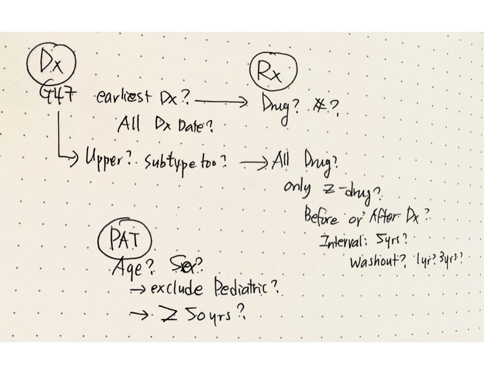

```{r, hide=TRUE}
#| echo: false
#| warning: false
#| message: false

library(tidyverse)
```

## Introduction

Duplicate records are one of the first things I check in EHR data because they can quietly distort almost every downstream analysis. But, the tricky part is that not all repeated rows mean the same thing.

Some are true data errors. Some are repeated documentation. Some reflect different clinical or administrative sources representing related information. In other words, repeated rows are not always wrong, but unexplained repeated rows are dangerous.

This is easy to overlook. At first glance, the data may look fine: same patient, same date, same diagnosis, multiple rows. It is tempting to just remove duplicates with `distinct()` or `unique()` and then move on. But in EHR data, deduplication is not just an automated coding step. It is a clinical and analytic decision.

Before removing rows, I usually ask a simple question:

**What is one row supposed to represent?**

-   A patient?\
-   A diagnosis code?
-   A unique medication?\
-   A pharmacy dispensing record?

The answer changes what should be kept or removed.

There are many other situations, but in this post, I walk through the three common situations where repeated rows appear in EHR data and explain why they should not all be handled the same way.

{fig-align="center" width="75%"}

## Example 1. Related diagnosis codes on the same date

One common situation I see is multiple diagnosis codes for the same patient on the same date. At first glance, this looks like a duplicate problem. Sometimes, it is. But often, it is more complicated than that.

For example, if we are defining a sleep disorder cohort using ICD-10 codes, the same patient may have several sleep-related codes recorded on the same date. These codes may reflect related diagnoses, specific conditions, or non-specific documentation within the broader sleep-disorder category.

The problem is not simply that there are multiple rows. The problem is whether we know what those rows mean for the question we are asking.

### Toy data example

Suppose we extracted diagnosis records for patients with sleep disorders using G47.xx codes. The following table shows a small subset of the data:

```{r}
ehr_dx <- tibble::tribble( ~PATID, ~DATE_DX, ~ICD10, ~ICD10_TXT, 
                           "AA001", "2026-01-15", "G47.00", "Insomnia, unspecified", 
                           "AA001", "2026-01-15", "G47.33", "Obstructive sleep apnea", 
                           "AA001", "2026-01-15", "G47.9", "Sleep disorder, unspecified", 
                           "BB002", "2026-02-10", "G47.00", "Insomnia, unspecified", 
                           "CC003", "2026-03-05", "G47.33", "Obstructive sleep apnea" )

ehr_dx
```

In this toy dataset, individual “AA001” has three sleep-related diagnosis codes on the same date. Whether this is a problem depends on our question.

If the goal is to identify whether an individual has any sleep disorder, “AA001” should likely be counted once. If the goal is to examine specific sleep-related diagnosis and clinical complexity, these codes should be maintained because AA001 has insomnia (G47.00), OSA (G47.33), and unspecified sleep disorders (G47.9).

This is why I try not to "clean" these rows too quickly. Cleaning without defining the target structure can remove information that may be useful later.

### Why it matters

If we count each diagnosis code as a separate patient or event, we may overestimate the prevalence of sleep disorders. But, if we collapse all sleep-related codes too early, we may lose clinically useful information about specific conditions (e.g., subtypes).

```{r}
nrow(ehr_dx)
```

There are five diagnosis rows. But if we count unique patients, there are only three patients:

```{r}
n_distinct(ehr_dx$PATID)
```

This difference matters. If we confuse diagnosis rows with patients, we may overestimate disease burden, exposure frequency, or clinical complexity.

### How to check

A simple first check is to compare the number of rows with the number of unique patients.

```{r}
ehr_dx %>%
  summarise(
    n_rows = n(), 
    n_unique_patients = n_distinct(PATID)
  )
```

Next, check how many diagnosis codes each patient has on each date.

```{r}
ehr_dx %>%
  count(PATID, DATE_DX, name = "n_diagnosis_codes") %>%
  filter(n_diagnosis_codes > 1)
```

If the goal is to create a patient-level sleep disorder cohort, we can collapse the data to one row per patient.

```{r}
sleep_cohort_patient_level <- ehr_dx %>%
  distinct(PATID, .keep_all = TRUE)

sleep_cohort_patient_level
```

However, I usually prefer keeping diagnosis-code information separately for later use. Reviewers, collaborators, or stakeholders may ask which specific diagnoses were included. Also, I may not need the subtype information today, but I often regret not keeping it later.

One way to keep this information is to summarize the unique diagnosis codes for each patient.

```{r}
ehr_dx %>%
  group_by(PATID) %>%
  summarise(
    n_unique_dx_codes = n_distinct(ICD10),
    dx_codes = paste(unique(ICD10), collapse = " | "),
    .groups = "drop"
  )
```

**Tip**: Once you define structure, collapse for the analysis, but keep the information somewhere.

## Example 2. Merge-created duplicates

In EHR data, we often combine information from multiple sources: billing records, encounter diagnoses, clinician visit records, medication orders, pharmacy dispensing records, and problem lists. When these sources are merged, the same clinical episode may appear more than once for the same patient.

Suppose we want to identify patients who were newly diagnosed with insomnia, prescribed zolpidem, and actually picked up the medication from the pharmacy. This sounds simple, but it requires linking at least three sources: diagnosis records, medication orders, and pharmacy dispensing records.

The challenge is that each source has a different meaning:

-   a diagnosis record indicates that insomnia was documented;
-   a medication order indicates that zolpidem was prescribed;
-   a pharmacy dispensing record indicates that the medication was actually picked up or dispensed.

If we merge these sources without defining the analytic unit, one clinical episode can easily turn into multiple rows.

### Toy data example

```{r}
diagnosis_data <- tribble(
  ~PATID,  ~DATE_DX, ~ENCOUNTER_ID, ~ICD10, ~ICD10_TXT,
  "AA001", "2026-01-15",    "E1001",      "G47.00",        "Insomnia, unspecified",
  "BB002", "2026-02-10",    "E1002",      "G47.00",        "Insomnia, unspecified",
  "CC003", "2026-03-05",    "E1003",      "G47.00",        "Insomnia, unspecified"
)

medication_order_data <- tribble(
  ~PATID,  ~DATE_ORDER,  ~ENCOUNTER_ID, ~ATC_CODE, ~RX_NAME, ~DOSE, ~DAYS_SUPPLY_ORDERED,
  "AA001", "2026-01-15", "E1001", "N05CF02",  "zolpidem",  "5 mg", 30,
  "BB002", "2026-02-10", "E1002", "N05CF02",  "zolpidem",  "5 mg", 30,
  "CC003", "2026-03-05", "E1003", "N05CF02",  "zolpidem",  "5 mg", 30
)

pharmacy_dispensing_data <- tribble(
  ~PATID,  ~DATE_DISPENSE, ~RX_NAME, ~ATC_CODE,  ~DOSE,    ~DAYS_SUPPLY_DISPENSED,
  "AA001", "2026-01-17",   "zolpidem",       "N05CF02", "5 mg",   30,
  "AA001", "2026-01-17",   "atorvastatin",   "C10AA05", "20 mg",  30,
  "AA001", "2026-01-17",   "metformin",      "A10BA02", "500 mg", 30,
  "BB002", "2026-02-10",   "zolpidem",       "N05CF02", "5 mg",   30
  # CC003 had a medication order, but no dispensing record
)
```

Now suppose we merge the dispensing data by "PATID" only.

```{r}
bad_merge <- diagnosis_data %>%
  left_join(medication_order_data, by = c("PATID", "ENCOUNTER_ID")) %>%
  left_join(pharmacy_dispensing_data, by = "PATID")

bad_merge
```

This creates repeated rows for *AA001*. The insomnia-zolpidem pair is now linked not only to zolpidem, but also to atorvastatin and metformin. The problem is not that *AA001* has multiple medications. The problem is that the merge attached unrelated medications to the wrong clinical episode.

### Why it matters

For the simple question, **"Did this individual pick up zolpidem?"**, the error may be easy to notice. But for medication exposure calculations, this can become a serious problem.

If we calculate total medication burden, days supplied, or number of medications after the insomnia diagnosis based on prescription data, a broad merge by `PATID` alone can create a misleading picture of medication exposure. In this example, *AA001* would look like they had three medications attached to the insomnia-zolpidem episode, even though only zolpidem is relevant to the question.

This can lead to:

-   overcounting the number of prescribed medications linked to an encounter;\
-   inflating total days supplied;\
-   assigning unrelated medications to the wrong diagnosis;\
-   misclassifying medication exposure;\

### How to check

First, check whether the merge increased the number of rows.

```{r}
diagnosis_data %>%
  summarise(
    original_diagnosis_rows = n(),
    original_patients = n_distinct(PATID)
  )

bad_merge %>%
  summarise(
    merged_rows = n(),
    merged_patients = n_distinct(PATID)
  )
```

If the row count increased, do not automatically remove duplicates. First check whether the increase is clinically meaningful or caused by an overly broad join.

For this case, we only need zolpidem dispensing records. One simple approach is to filter the dispensing data before merging.

```{r}
pharmacy_dispensing_data_zolpidem <- pharmacy_dispensing_data %>%
  filter(RX_NAME == "zolpidem")

better_merge <- diagnosis_data %>%
  left_join(medication_order_data, by = c("PATID", "ENCOUNTER_ID")) %>%
  left_join(
    pharmacy_dispensing_data_zolpidem,
    by = c("PATID", "RX_NAME", "ATC_CODE", "DOSE"),
    suffix = c("_ORDER", "_DISPENSE")
  )

better_merge
```

Now we can answer the original question: who had an insomnia diagnosis, received a zolpidem order, and had evidence of pharmacy dispensing?

```{r}
insomnia_zolpidem_dispensed <- better_merge %>% 
  filter(
    ICD10 == "G47.00", 
    RX_NAME == "zolpidem", 
    ATC_CODE == "N05CF02", 
    !is.na(DATE_DISPENSE)
    ) %>%
  select(PATID, ENCOUNTER_ID, DATE_DX, ICD10, RX_NAME, ATC_CODE, DATE_ORDER, DATE_DISPENSE, DOSE) 

insomnia_zolpidem_dispensed
```

In this toy example, *AA001* and *BB002* meet the full definition. Both had an insomnia diagnosis, a zolpidem order, and a matching pharmacy dispensing record. *CC003* had an insomnia diagnosis and a zolpidem order, but no dispensing record, so CC003 should not be classified as having picked up zolpidem.

The important point is that the bad merge created repeated rows by linking all pharmacy records for AA001 to the insomnia-zolpidem episode. This is not a problem to fix with `distinct()`. The better solution is to fix the merge logic.

**Tip**: If a merge increases the numbber of rows, do not immediately deduplicate; first check whether the join keys were too broad.

## Example 3. Technical duplication

Some duplicate rows are true technical errors. (Unfortunately) Unlike the earlier examples, these rows do not reflect different diagnosis subtypes, different data sources, or a meaningful one-to-many relationship. They are simply repeated records.

This can happen during data extraction, SQL joins, repeated pulls, or file appending. This is the type of duplicate where `distinct()` may actually be appropriate, but only after confirming that the repeated rows are truly identical.

### Toy data example

```{r}
example3_data <- tribble(
  ~PATID,  ~DATE_DX,      ~ENCOUNTER_ID, ~ICD10,   ~RX_NAME,   ~ATC_CODE,  ~DOSE,
  "AA001", "2026-01-15", "E1001",       "G47.00", "zolpidem", "N05CF02", "5 mg",
  "AA001", "2026-01-15", "E1001",       "G47.00", "zolpidem", "N05CF02", "5 mg",
  "BB002", "2026-02-10", "E1002",       "G47.00", "zolpidem", "N05CF02", "5 mg",
  "CC003", "2026-03-05", "E1003",       "G47.00", "zolpidem", "N05CF02", "5 mg"
)

example3_data
```

In this example, the first two rows are identical. They have the same patient ID, date, encounter ID, diagnosis code, medication name, ATC code, and dose. There is no additional clinical information in the second row.

### Why it matters

Technical duplicates can inflate counts and distort downstream summaries.

For example, if we count the number of zolpidem-related records, *AA001* is counted twice even though there is only one clinical episode.

```{r}
example3_data %>%
  count(PATID, DATE_DX, ENCOUNTER_ID, ICD10, RX_NAME, ATC_CODE, DOSE, name = "n_rows")
```

If we later calculate medication exposure, visit frequency, or diagnosis counts, this duplicated row may make the patient appear to have more records than they actually do.

### How to check

A simple check is to count repeated rows across the variables that should define a unique record.

```{r}
example3_data %>%
  count(PATID, DATE_DX, ENCOUNTER_ID, ICD10, RX_NAME, ATC_CODE, DOSE, name = "n_rows") %>%
  filter(n_rows > 1)
```

If the duplicated rows are truly identical and do not represent separate clinical events, they can be removed.

```{r}
example3_data_clean <- example3_data %>%
  distinct()

example3_data_clean
```

Then compare the number of rows before and after removing exact duplicates.

```{r}
tibble(
  rows_before = nrow(example3_data),
  rows_after = nrow(example3_data_clean)
)
```

**Tip:** Use `distinct()` only after confirming that the repeated rows are truly identical.

## Final thought

Deduplication sounds like a simple preprocessing step. In practice, I have found that it is one of those small steps that people often rush through because the table looks “clean enough” at first glance.

That is where the risk starts.

Repeated rows in EHR data are not always errors. Some repeated rows reflect clinically meaningful information, some are created during merging, and some are true technical duplicates. Treating all of them the same way can quietly change the cohort, inflate exposure counts, or remove useful clinical information.

Before deduplicating, I usually ask three questions:

1.  Do the repeated rows represent different clinical information?
2.  Were the repeated rows created by the merge?
3.  Are the rows truly identical technical duplicates?

The goal is not to make the dataset smaller. The goal is to make sure each row represents the intended analytic unit.

In EHR data, “small” preprocessing decisions can become large analytic errors later. I hope sharing these practical examples helps others who are just starting to work with EHR data avoid some of these mistakes earlier.

**Note: All examples are synthetic toy data created for educational purposes. They do not contain real patient records, patient identifiers, institutional data, or results from any specific health system. They are informed by common data patterns encountered in EHR/RWD work, but they do not represent any actual patient, clinical case, or health system.**

**Scope.** My research background is primarily in older adult populations, neurodegenerative diseases such as Alzheimer’s disease, Parkinson’s disease, and dementia, and sleep disorders. Many examples in this blog therefore use those clinical areas. The general data-quality principles may apply broadly, but the specific examples may not generalize to all clinical populations, such as pediatric populations.
